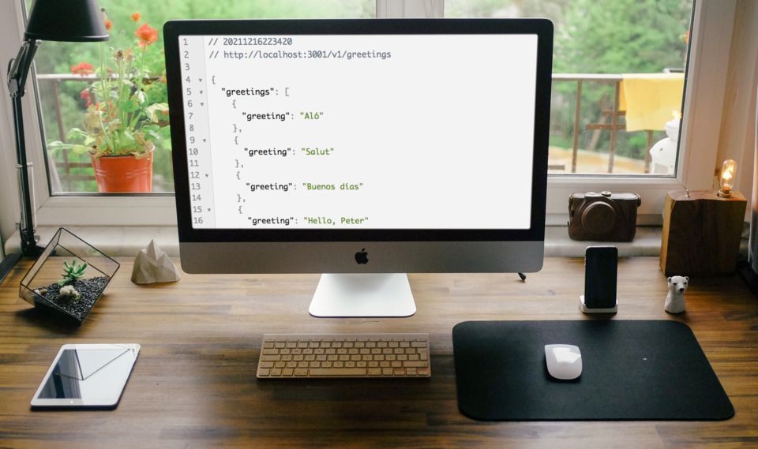

# Hello-Rails-Back-End

> A greeting API made in Ruby on Rails

Use this API endpoint for displaying 5 different greetings

## Built With

- Ruby '2.7.2'
- Rails '6.1.4.4'
- PostgreSQL '11'

## Getting Started

To get a local copy up and running follow these simple example steps.

### Prerequisites
 A modern web browser (Chrome, Firefox, Safari, Microsoft Edge)

### Usage
 Clone the project by typing in your terminal `git clone https://github.com/SunnySparks/hello-rails-back-end.git`.

 Change directory `cd` into the just created from the project.

 Run `$ bundle install` to install gems.
 
 To set up database run `$ rails db:create` \
`$ rails db:migrate` \.

 To open the server in the required port run `$ rails server -p 3001` 
 
## Run tests

 Run `$ rubocop` for Ruby linters.

## Access Endpoints
GET \
You can fetch the greetings \
`http://localhost:3001/v1/greetings`

## Frontend interface
[Hello-React-Front-End](https://github.com/SunnySparks/hello-react-front-end)

## Author

👤 **Sunny Díaz**

- GitHub: [@SunnySparks](https://github.com/SunnySparks)
- Twitter: [@JosfranT6](https://twitter.com/JosFranT6)
- Instagram: [@webdev.sunnydiaz](https://www.instagram.com/webdev.sunnydiaz/)
- Portfolio: [sunnydiaz.com](https://sunnydiaz.com/)
- LinkedIn: [LinkedIn](https://www.linkedin.com/in/jose-f-silva/)

Contributions, issues, and feature requests are welcome!

Feel free to check the [issues page](https://github.com/SunnySparks/hello-rails-back-end/issues).

## Show your support

Give a ⭐️ if you like this project!

## Acknowledgments

- Ruby on Rails best practices
- API endpoints creation
- Creating API data for frontend consumption
- Databases setup

## 📝 License

This project is [MIT](./MIT.md) licensed.